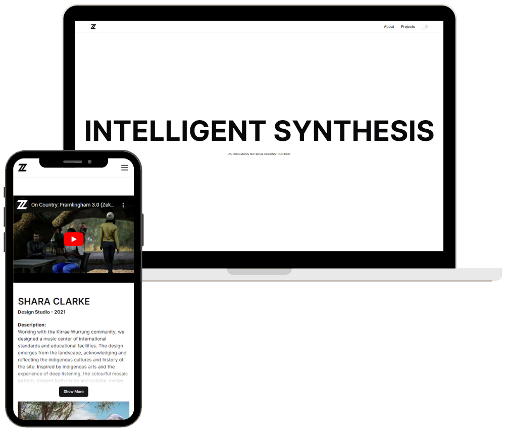

<h2 align="center">
  Zeke Zhang  Portfolio Website<br/>
  <a href="https://zekezhang.com" target="_blank">zekezhang.com</a>
</h2>




My architectural design portfolio website built with Next.js and Tailwind CSS, showcasing a range of projects and skills in a clean, minimalistic manor. It is fully responsive across all devices.


<h3 align="center">
    🔹
    <a href="https://github.com/sean1832/portfolio/issues">Report Bug</a> &nbsp; &nbsp;
    🔹
    <a href="https://github.com/sean1832/portfolio/issues">Request Feature</a>
</h3>


# 🌟 Features

- **Responsive Design**: Works smoothly on mobile, tablet, and desktop.
- **Customizable Content**: Easy to modify content to display your own projects and profile. (See [Managing Content](#managing-content). *This feature is still in development*)
- **SEO Optimized**: Includes metadata setup for SEO.

# 📋 Using This Repository

Feel free to use this codebase as a template for your own portfolio. If you do, please credit the original author, [@sean1832](https://github.com/sean1832/portfolio).

- 🌟 **Star this repository** if you find it useful!
- 💡 **Fork this repository** to begin using it as a base for your own project.

# 🛠️ Technologies Stack

- **[Next.js](https://nextjs.org/)** - The React framework for production.
- **[Tailwind CSS](https://tailwindcss.com/)** - A utility-first CSS framework.
- **[Node.js](https://nodejs.org/en/)** - JavaScript runtime built on Chrome's V8 JavaScript engine.
- **[Shadcn UI](https://ui.shadcn.com/)** - A UI component library for React.
- **[JSON Schema](https://json-schema.org/)** - Validator for JSON documents.
- **[Vercel](https://vercel.com/)** - Platform for frontend frameworks and static sites.

# 🚀 Getting Started

### Prerequisites

Ensure you have [Node.js](https://nodejs.org/en/) and [git](https://www.git-scm.com/downloads) installed on your machine.

### Installation

Clone the repository and install dependencies:

```bash
git clone https://github.com/sean1832/portfolio.git
cd portfolio
npm install .
```

### Running Locally

Build and run the project:

```bash
npm run build
npm run start
```

# 🛠 Managing Content

Currently the content is stored in [`src/data`](./src/data/) folder. You can modify the content in the following files:

| filename                                    | description                   |
| ------------------------------------------- | ----------------------------- |
| [`projects.json`](./src/data/projects.json) | Featured projects information |
| [`profile.json`](./src/data/profile.json)   | Personal profile information  |
| [`navbar.json`](./src/data/navbar.json)     | Navbar links                  |

## Site Metadata

You can modify the site metadata in the [`./src/app/layout.js`](./src/app/layout.js) file. The metadata includes the site title, description, and social media links.

<details><summary><strong>Show Example</strong></summary>

```javascript
export const metadata = {
  metadataBase: new URL("https://zekezhang.com"), // Your site URL
  title: {
    default: "Zeke Zhang", // Default title
    template: "%s | Zeke Zhang", // Template title, %s will be replaced with the page title
  },
  description:
    "Melbourne based designer and researcher specializing machine learning, algorithmic design, and low-tech assembly craft in architecture.",
  icons: {
    icon: ["/favicon.ico?v=4"], // Favicon
    apple: ["/apple-touch-icon.png?v=4"], // Apple touch icon
    shortcut: ["/apple-touch-icon.png"], // Shortcut icon
  },
  keywords: [
    "Architecture",
    "Low-tech assembly craft",
    "Autonomos Material Reconstruction",
    "machine learning",
    "algorithmic design",
    "diffusion tectonics",
  ],
  creator: "Zeke Zhang", // Website creator
  manifest: "/site.webmanifest", // Path to site manifest
  authors: [{ name: "Zeke Zhang" }], // Website authors
  openGraph: {
    title: {
      default: "Zeke Zhang | Intelligent Synthesis", // Default title
      template: "Zeke Zhang | %s", // Template title, %s will be replaced with the page title
    },
    images: ["/opengraph-image.jpg"], // Open graph images
    description:
      "Melbourne based designer and researcher specializing machine learning, algorithmic design, and low-tech assembly craft in architecture.",
    type: "website", // Open graph type
    locale: "en_US", // Open graph locale
    url: "https://zekezhang.com", // Website URL
    siteName: "Zeke Zhang", // Website name
  },
};
```

</details>

## Managing Projects

The [`projects.json`](./src/data/projects.json) file located in the [`src/data`](./src/data/) directory plays a key role in managing the projects showcased on your portfolio website. Here's an in-depth guide on how to effectively update and manage this file.

### Structure of [`projects.json`](./src/data/projects.json)

The JSON file is structured as an array of objects, each representing a project. Below is a detailed description of each field within a project object:


```json
{
  "name": "The name of the project",
  "type": "The type of project (e.g., Design Studio, Research) - must be one of predefined enum values",
  "year": "The year the project was completed or published",
  "description": "A short description of the project",
  "longDescription": "A more detailed description of the project",
  "href": "A URL link to more details about the project or an external site",
  "video": {
    "src": "URL to a video showcasing the project",
    "alt": "Alternative text for the video"
  },
  "location": {
    "name": "Name of the location relevant to the project",
    "url": "Optional URL providing more details about the location"
  },
  "group": ["Array of strings used to tag or categorize the project"],
  "awards": [
    {
      "name": "Name of the award",
      "url": "URL to the award description",
      "img": "URL to an image of the award"
    }
  ],
  "publications": [
    {
      "name": "Name of the publication",
      "url": "URL to the publication",
      "img": "URL to an image of the publication cover"
    }
  ],
  "bentoAttributes": {
    "className": "CSS class for additional styling attributes"
  },
  "tutors": [
    {
      "name": "Name of a tutor or mentor involved in the project",
      "url": "URL to tutor's professional profile"
    }
  ],
  "images": [
    {
      "src": "URL to an image associated with the project",
      "alt": "Alternative text for the image",
      "className": "CSS class for styling the image",
      "href": "Link to the source of the image",
      "caption": "Caption for the image",
      "credit": {
        "text": "Text crediting the source of the image",
        "url": "URL to the source of the image"
      },
      "isHero": "Boolean indicating if this is the main image for the project",
      "isAdaptive": "Boolean indicating if the image is adaptive",
      "isCarousel": "Boolean indicating if the image should be included in a carousel",
      "isExternal": "Boolean indicating if the image is from an external source",
      "isVideo": "Boolean indicating if the image is actually a video thumbnail"
    }
  ]
}
```

### Adding a New Project

To add a new project, simply append a new object to the array in [`projects.json`](./src/data/projects.json) using the schema provided above. Ensure all required fields are included to maintain site functionality.

## Managing Profile Information

Profile information is managed through the [`profile.json`](./src/data/profile.json) file located in the [`src/data`](./src/data/) directory. This file is structured as a single JSON object representing your personal or professional profile.

### Structure of [`profile.json`](./src/data/profile.json)

Here’s what each field should contain:

```json
{
  "name": "Your full name",
  "about": "A brief introduction or biography",
  "image": {
    "src": "Path to your profile picture",
    "alt": "Alternative text for the profile picture"
  },
  "keywords": [
    "Relevant keywords to your profession or skills (This will be displayed as rotating text on the homepage)"
  ],
  "slogan": "A catchy or meaningful slogan (This will be displayed as a hero text on the homepage)",
  "social": {
    "instagram": "URL to your Instagram profile",
    "github": "URL to your GitHub profile",
    "youtube": "URL to your YouTube channel"
  },
  "contact": {
    "email": "Your email address",
    "phone": "Your phone number"
  }
}
```

## Navbar

If for reasons you want to change the navbar links, you can do so by modifying the [`navbar.json`](./src/data/navbar.json) file located in the [`src/data`](./src/data/) directory. The file is structured as an array of objects, each representing a link in the navbar.

```json
[
  {
    "title": "Section 1",
    "url": "/#section-1",
    "id": "section-1"
  },
  {
    "title": "Section 2",
    "url": "/#section-2",
    "id": "section-2"
  }
]
```

## Images

Images are stored in the [`public`](./public/) folder. You can replace the images with your own images. Make sure to update the image paths in the [`projects.json`](./src/data/projects.json) file.

# 🤝 Contributing

Contributions to improve this project are welcome. Please follow the standard fork-and-pull request workflow.

# 📄 License

[Apache License 2.0](LICENSE)

# 👏 Acknowledgments

- Thanks to all the open-source tools and libraries that made this project possible.
- Special thanks to [@sean1832](https://github.com/sean1832) for the initial setup.
